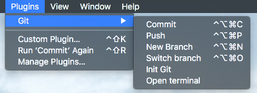

git-sketch-plugin
=========

 A Git client built right into <a href="http://www.bohemiancoding.com/sketch/">Sketch</a>. Generate pretty diffs so that everybody knows what are the changes!

 Compatible with Sketch 3.4.

## Requirements
* [Git](https://git-scm.com/)
* [Sketchtool](http://www.sketchapp.com/tool/) installed in `/usr/local/bin/sketchtool` (default location)

## Installation
* Download this repo as a zip
* Double-click on Git.sketchplugin

## Default key bindings

 Action                       | Shortcut
:-----------------------------|:---------------------------------------
 Commit your changes          | <kbd>ctrl</kbd> + <kbd>alt</kbd> + <kbd>cmd</kbd> + <kbd>c</kbd>
 Push your changes            | <kbd>ctrl</kbd> + <kbd>alt</kbd> + <kbd>cmd</kbd> + <kbd>p</kbd>
 Create a new branch          | <kbd>ctrl</kbd> + <kbd>alt</kbd> + <kbd>cmd</kbd> + <kbd>n</kbd>
 Switch to an existing branch | <kbd>ctrl</kbd> + <kbd>alt</kbd> + <kbd>cmd</kbd> + <kbd>o</kbd>

## Git command behind

Client                       | Command
:----------------------------|:------------------------------------------
 Commit                      | `git commit -m 'message' -a`
 Push                        | `git push -q`
 New Branch                  | `git checkout -qb branchName`
 Switch Branch               | `git checkout -q branchName`
 Add file to git             | `git add currentFile`
 Init Git repo               | `git init && git add currentFile`

## License

MIT
