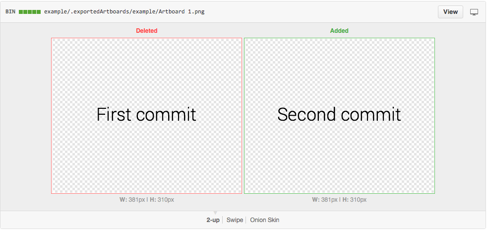
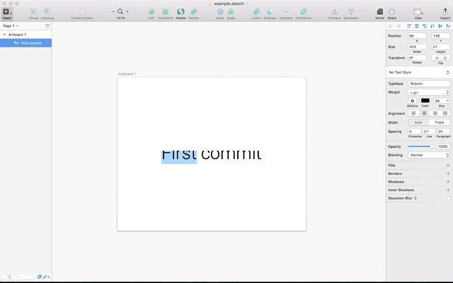

git-sketch-plugin
=========
 

 A Git client built right into [Sketch](http://www.bohemiancoding.com/sketch). Generate [pretty diffs](https://github.com/mathieudutour/git-sketch-plugin/pull/1/files) so that everybody knows what are the changes!

From ...

... To

## Requirements
* [Sketch](http://sketchapp.com/) >= 3.4 (**not** with the sandboxed version ie from the App Store).
* [Git](https://git-scm.com/) (coming with OS X so you shouldn't have to do anything)

## Installation
* [Download](https://github.com/mathieudutour/git-sketch-plugin/releases/latest) the latest release of the plugin
* Un-zip
* Double-click on Git.sketchplugin

## Documentation
For a Getting started guide, FAQ, etc. check out our [docs](https://github.com/mathieudutour/git-sketch-plugin/tree/master/docs)!

## Want to contribute?

Anyone can help make this project better - check out our [Contributing guide](/CONTRIBUTING.md)!
