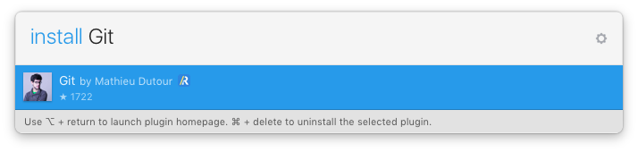

git-sketch-plugin
=========
 

 A Git client built right into [Sketch](http://www.bohemiancoding.com/sketch). Generate [pretty diffs](https://github.com/mathieudutour/git-sketch-plugin/pull/1/files) so that everybody knows what are the changes!

From ...

... To

## Requirements
* [Sketch](http://sketchapp.com/) >= 3.4 (**not** with the sandboxed version ie from the App Store).
* [Git](https://git-scm.com/) (coming with OS X so you shouldn't have to do anything)
* [Xcode Command Line Tools](http://osxdaily.com/2014/02/12/install-command-line-tools-mac-os-x/)

## Installation

### From a release

* [Download](https://github.com/mathieudutour/git-sketch-plugin/releases/latest) the latest release of the plugin
* Un-zip
* Double-click on Git.sketchplugin

### Install with Sketch Runner (simplest)

With Sketch Runner, just go to the `install` command and search for `Git`. Runner allows you to manage plugins and do much more to speed up your workflow in Sketch. [Download Runner here](http://www.sketchrunner.com).

### From the sources

* Clone the repo
* Install the dependencies (`npm install`)
* Build (`npm run build`)
* Double-click on Git.sketchplugin

## Documentation
For a Getting started guide, FAQ, etc. check out our [docs](https://github.com/mathieudutour/git-sketch-plugin/tree/master/docs)!

## Want to contribute?

Anyone can help make this project better - check out our [Contributing guide](/CONTRIBUTING.md)!
